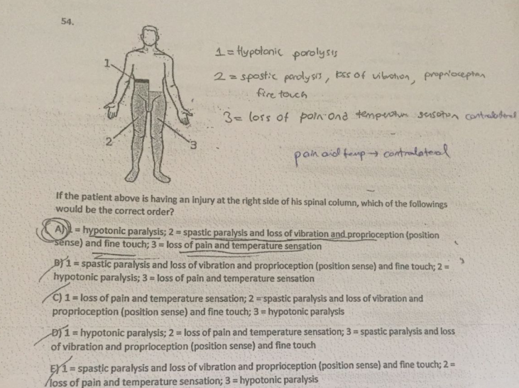
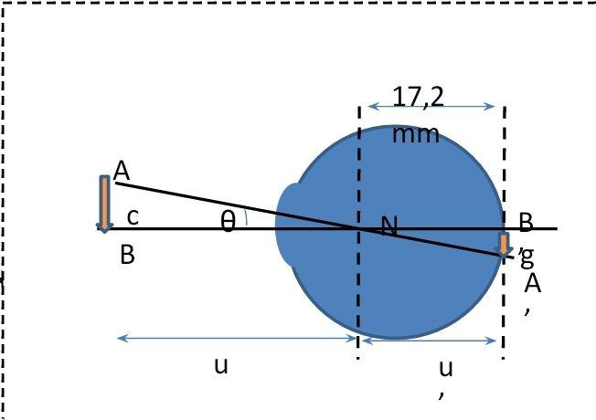
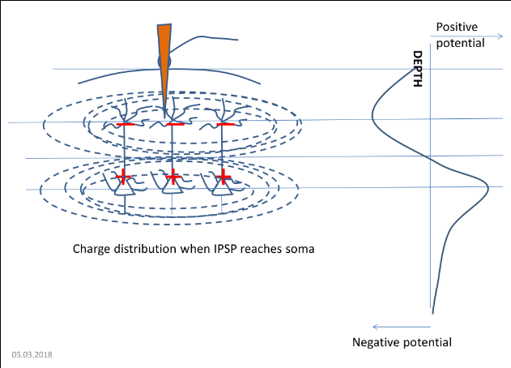
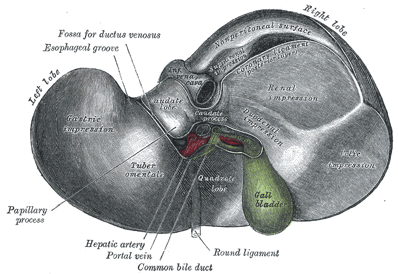
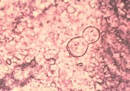
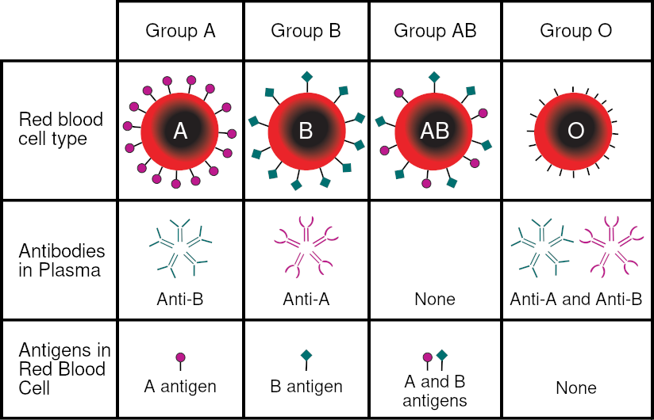
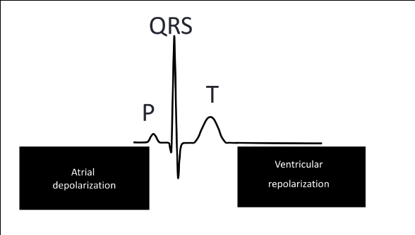
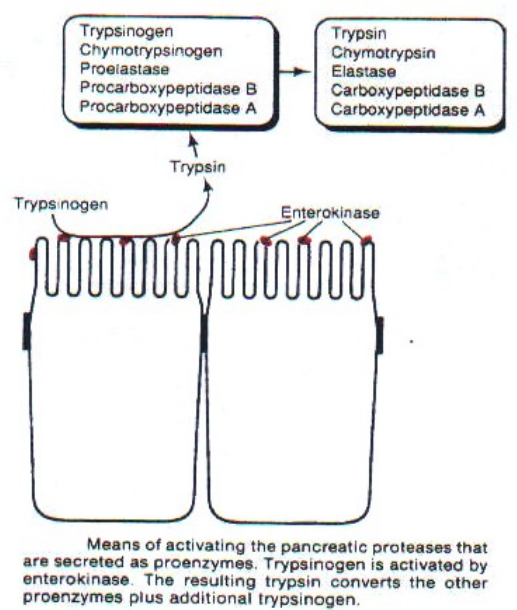
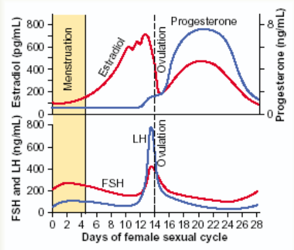

- [Çıkmışlar ve Kaynağı Bilinmeyen Sorular](#ckmlar-ve-kayna-bilinmeyen-sorular)
    - [Komite 1](#komite-1)
        - [Anatomi-1](#anatomi-1)
        - [Biyofizik-1](#biyofizik-1)
    - [Komite 2](#komite-2)
        - [Anatomi-2](#anatomi-2)
        - [Biyofizik-2](#biyofizik-2)
    - [Komite 3](#komite-3)
        - [Anatomi-3](#anatomi-3)
            - [Bu sene çıkmış olanlar](#bu-sene-ckm-olanlar)
        - [Mikrobiyoloji-3](#mikrobiyoloji-3)
    - [Komite 4](#komite-4)
        - [Anatomi-4](#anatomi-4)
        - [Mikrobiyoloji-4](#mikrobiyoloji-4)
    - [Fizyoloji (Final)](#fizyoloji-final)

# Çıkmışlar ve Kaynağı Bilinmeyen Sorular

## Komite 1

### Anatomi-1
1. Which spinal nerves comprise the cauda equina?
    - Lumbar, sacral, cocygeal
2. Which of the following nerves causes the adrenal medulla to release **epinephrine** and **norepinephrine**?
    - Sympathetic
3. Which of the following cranial nerves contribute into the structure **tractus solitarius nucleus**?
    - 7, 9, 10
4. Which of the following is the **first branch of the facial nerve in the facial canal**?
    - Greater petrosal nerve
5. Which head ganglion is not a sensory ganglion?
    - Otic ganglion
6. Kulağı temizlerken öksürmeye sebep olan nerve?
    - Auricular branch of the vagus nerve
7. Which of the following levels of anterior spinal column are **under-perfused**?
    - T4-L1
8. Major blood supply, yanlış olan?
    - anterior cerebral artey-lower parietal lobe
9. Most of the the **berry aneurism** occurs at?
    - Anterior communicating artery
10. Adamkiewicz artery, yanlış olan?
    - At anterior spinal syndrome, no innervation of the leg
11. Which one is the center for emotional response of pain?
    - Cingulate cortex
12. Not correct for spinal lemniscus?
    - Spinotectal tectal pathway is not a contributor to spinal lemniscus.
13. Ascending circuit of fine touch sensation, doğru olan?
    - 1st neuron is located at spinal ganglion
14. Which of the following is not part of the mesencephalon?
    - 3rd ventricle
15. Yanlış olan şık
    - Sense of vibration is conducted by anterolateral ascending system
16. Hangi sensation is not conducted by dorsal column system?
    - Temperature
17. 
18. Related with adaptive behaivour
    - Hypothalamus
19. Not component of hippocampus?
    - Amygdala
20. Which is not in diencephalon?
    - Lateral ventricle
21. Not correct of Horner syndrome?
    - effects always contralateral side of the body
22. External tympanic membrane
    - Cranial nerves 5 and 10

    Internal tympanic membrane
    - Cranial nerve 9
23. Circle of Willis?
    - **Heubner branch** is the branch of Anterior cerebral artery
24. Papillary reflex sorusu, hangisi yanlış?
    - Parasympathetic innervation, vasodilatation
25. Cavernous sinus (components)?
        
        1.Internal carotid artery
        2. Oculomotor
        3. Trochlear
        4. Abducens
        5. Opthalmic
        6. Maxillary
    - (A şıkkıydı sınavda)
26. Kulakla ilgili yanlış olan?
    - Reissner membrane cochlea ve scala tympani ayırır.
27. One guy testing wine and gargling, which nerves?
    -  Glossopharyngeal ve Vagus
    - IX and X
28. Lesion, effects, related with Horner syndrome?
    - Pancoast Tumor
29. Yanlış olan?
    - Primary motor cortex -> 7

### Biyofizik-1

1. Intensity -> Frequency of Action Potential

    Duration -> Change of frequency of Action Potential

2. Visual angle for 2 point discrimination; minimum distance of nodal point-retina?
    - 

    tan Θ = c/u = g (mm)/17.2(mm)
        
3. Desynchronized cell potentials
    - For desynchronized cells, potential equals to "square root of cell number" times "potential per cell":
        - Desyncronized cell number = D
        - Syncronized cell number = S
        - Potential of a single cell = e
        - Total desynchronized cell potential = Vdesync
        - Total synchronized cell potential = Vsync
            - √D * e = Vdesync
              
              e = vdesync / √D
              
              Vsync = e * S
        - AN EEG activity of *10 mV* is measured *from a desynchronized activity* of a group of 106 neurons. What would the amplitude of the potential be when 1% of these  cells are synchronized?
            - 106 * 10-2 = 104 = S
            - √106 * e = 10µV
              
              e = 10/1000 = 0,01µV
            -  Vsync = 0,01µV * 104              
               **Vsync = 100µV**

4. Visual Acuity is determined by:
    - Density of photoreceptors on the retina
    - Diffraction of light
        - When **pupil size increases, acuity increases**
        - When **it decreases, acuity also decreases**.
5. Aksonun myelinle kaplanması akson ptansiyelinin hızla yayılmasına sebep olur;
    - myelin, membranın direncini arttırır,
    - myelin, membranın kapasitansını azaltır,
    - myelin, kablo sabitini arttırır.
6. Membran direnci arttığında elektrotonik potential daha uzak mesafelere iletilir.
    - Membran kalınlığı azaldıkça elektrotonik potential daha uzak mesafelere iletilemez.
    - Hücre içi direnç azaldıkça _____
    - Çap büyüdükçe akım uzak yerlere gider.
7. Elektrotonik potential -> 30mV
    
    λ = 2 mm (kablo sabiti)

    x = 4mm

    Eex=?
    - Eex = E0 × $e$-x/λ
        - x uzaklığındaki potansiyel enerji
    - 30mV × $e$-4/2 = 30 × $e$-2
    - 3,9 mV
8. 9 × 106 => nöron sayısı

    desenkron aktivitesi => 1,5 mV

    bu hücrelerin %1'i senkron olursa E ne olur?
    - (9 × 106)-2 × e = 1,5 mV

        e = 1,5 / (3 × 103)

        S = (9 × 106) × 10-2 = 9 × 104

        (9 × 104) × 1,5 / (3 × 103)

        = **45 mV**
9. **Pyramidal hücrelerin uyarılması**yla beyinde oluşan yük dağılımı
    - 
10. Visual angle increase:
    - retinadaki görüntü büyür,
    - more 
    - acuity increases,
    - receptors receives more light,
11. 5 mm uzaklıkta bulunan cisimde, yan yana 2 noktayı ayırt edebilmek için gereken minimum mesafe ne olur?
    - g = 0,005 mm (görüntünün boyu)
    - 17 mm = götüntü uzaklığı
    - 
    - 5/17 = x/0,005
12. - Basilar membranın homojen yapısı yok
    - Basilar membranın genişliği basilar membran boyunca değişir.

## Komite 2

### Anatomi-2
1. Can not define the boundaries of the superior thoracic aperture?
    - Posterior body of T2
2. Not correct for transverse thoracic muscle?
    - Elevates costal cartilages
3. When cut lead to a droppy shoulder nerve?
    - Spinal root of accessory nerve (C1-C5)
4. The right posterior intercostal veins drain directly into directly?
    - Azygous vein
5. Emergency openning into airway, cricothyroid pierced?
    - Superior to cricoid cartilage
6. Tonsillar tissue found at?
    - Between the palatoglossal and palatopharyngeal folds
7. Correct for mucosa at the upper larynx innervation?
    - Internal laryngeal nerve
8. Right atrioventricular valve is prevented from everything by ?
    - Papillary muscles
9. Which accompanies esophagus while passing down through diaphram?
    - Vagus nerve
10. Phrenic nerves innervate?
    - Diaphram, parietal pleura, pericardium
11. Coronary arteries?
    - arise from ascending aorta & filling during diastole?
12. Which paranasal sinuses open into middle meatus?
    - Anterior ethmoid, frontal  maxillary sinuses
13. The walls of bronchioles contain
    - Smooth muscle, respiratory epithelium
14. Common carotid artey is a branch of?
    - **Right** common carotid
        - Brachiocephalic
    - **Left**
        - Aorta
15. In mouth this runs posteriorly?
    - **palatopharyngeal** arch
        - posterior
    - palatoglossal
        - anterior
16. This portion of peritoneum attaches liver to the anterior abdominal wall & diaphram?
    - Falciform ligament

### Biyofizik-2

1. Çapı 1, içindeki kanın hızı 40 olan aortun çapı anevrizma sonucu 2 kat artmıştır. Bunun sonucunda hız ne olur?
    - Q = Flow Rate = A × v
    - π×12 × 40 = π×22 × v
    - v = 10
2. Pozitif geri beslemeli bir sistemde açık döngü kazancı 0,3 ise duyarlılık?
    - Pozitif Açık döngüde duyarlılık 1/(1-G)
    - Negatif açık döngüde 1/(1+G)
3. Hangisi doğrudur?
    - Pozitif uçtan negatif uca akım çıktığından pozitif uç kaynak olur.
    - Negatif uca akım geldiğinden (-) uç çukur olur.
    - Akım 1/r ile ters orantılıdır.
        - **1,2 ve 3**

## Komite 3

### Anatomi-3

1. Pancreas çıkan vessel
    - *Probably* superior mesenteric artery
2. İlk kalıcı molar diş 6 yaşında çıkmaz.
3. Mide pylori'nin liver'da değdiği yer
    - Quadrate lobe
4. **Left gastric artery**, **Hepatic artey proper**'dan çıkmaz.
5. Right testicular artery (????)
    - Yan bilgi olaraktan, **left gonadal vein**, **left renal vein**'e dökülürken, **right gonadal vein** **inferior vena cava**'ya dökülür. 
6. Quadrate lobe position:
    - On the **left**, by **round ligament** (or umbilical vein for fetuses)
    - on the **right**, by **gallbladder**
    - **behind**, by **porta hepatis**
    - 
7. Esophagus blood supply
    - Artery
      - Inferior thyroid artery (upper)
      - thoracic part of aorta (middle)
      - left gastric artery (lower)
    - Vein
      - Inferior thyroid vein (upper)
      - azygos veins (middle)
      - left gastric vein (from portal vein) (lower)

#### Bu sene çıkmış olanlar

1. Common bile duct pancreas'ın neresinde bulunur?
    - Superior to pancreas
    - Daha sonra pancreasın içinden geçip Ampulla of Vater alınır.
2. Portal vein pancreasın neresinde bulunur?
    - Behind the neck of pancreas
3. Treitz ligament duodenumun hangi partında bulunur?
    - Duodenojejunal junction
    - **4**
4. Dorsal mesogastrium derivatives
    - Dorsal mesogastrium develops into **greater omentum**
5. Ulcer in lesser curvature
    - Left Gastric
    - [Bu konuyla alakalı bir soru (proprofs)](https://www.proprofs.com/discuss/q/78228/patient-was-diagnosed-with-bleeding-ulcer-of-the-lesser)
6. Duodenal ulcer
    - Gastroduodenal artery
7. Pancreas'ın arkasında olmayan damar?
    - The aorta and inferior vena cava pass posteriorly to the head of the pancreas.
    - The superior mesenteric artery lies behind the neck of the pancreas and anterior to the uncinate process.
    - Posterior to the neck of the pancreas, the splenic and superior mesenteric veins unite to form the hepatic portal vein.
8. Retroperitoneal **olmayan** organ (x2)
    - Spleen
9. Colon ile Abdominal Wall arası bölge
    - Gutter
    - ([Paracolic Gutters](http://www.wiki-zero.net/index.php?q=aHR0cHM6Ly9lbi53aWtpcGVkaWEub3JnL3dpa2kvUGFyYWNvbGljX2d1dHRlcnM))
10. Related with tongue *(cevabı verilmemiş, aşağıdakileri ben ekledim)*
    - Lingual frenulum
        - Attachment of tongue to oral floor
    - Lingual artery
    - Linguan vein
    - **Hypoglossal Nerve** for motor functions
        - Exception is the **palatoglossus** muscle which is innervated by **vagus**
    - Anterior two third of tongue
        - **Chorda tympani** of Facial nerve for taste
        - **lingual nerve** of mandibular for sensation
    - Posterior one third of tongue
        - Glossopharyngeal nerve for both taste and sensation
11. Cervical Esophagus'un etrafındakiler
    - Posterior
        - Vertebral column
    - Laterally 
        - Lobes of thyroid gland
    - Anterior
        - Trachea and the recurrent laryngeal nerves
12. Midesi tıkanan çocuk
    - Pylorus
    - (Maybe it is called pyloric stenosis => [Google search](https://www.google.com/search?q=pyloric+stenosis))

### Mikrobiyoloji-3

1. ECG changes were seen, chest X-ray will reveal **cardiomegaly**, sebep?
    - Coxsackie B

2. Outbreak of hepatitis, in (suyu temiz olmayan bir bölge, fecally contaminated). Most patients reported fever, nausea, vomiting, weight loss. Followed by jaundice, pruritus, anti-HAV IgM negative. There are **pregnant women** in the area. Why are they at risk?
    - Fulminant Hepatitis, HEV
3. Which RNA viruses replicate in the cell nucleus?
    - Influenza and HIV
4. **Window period**'da, acute hepatitis'de bulunan hangisidir?
    - **Anti-HBc**
5. HBsAg **pozitif**, Anti-HBs **pozitif** (Ses kaydından: "*Kişi enfekte, kronik mi akut mu*"). HBeAg **pozitif**, Anti-HBc IgM **pozitif**.
    - Akut Hepatit B
6. Which one is true for HIV/AIDS?
    - Perinatal transmission of the virus from mother to baby is most commonly with breast-feeding.
7. Which of the following DNA viruses cause different type of infections like respiratory tract, gastroenteritis, epidemic conjunctivitis, hemorrhagic cystitis?
    - Adenovirus
8. a 25 year-old women presents to the local clinic with fever, malase, lymphadenopathy, pharyngitis("*Infectios mononucleosis tablosu*"). Predominance lymphocyte var however heterophile antibody **monospot test is negative**.
    - CMV
    - (Ses kaydından: "*En sıklıkla bu duruma yol açan **EBV**, EBV'de monospot test **positive**. Infectious mononucleosis olup heterophile negative olursa en sık etken **CMV***")
9. Influenza binds to sensitive cells, major antigen for neutralizing antibodies?
    - Hemagglutinin
10. HIV tarama testi olan en sık tercih edilen?
    - 4th generation antibody test

## Komite 4

### Anatomi-4
1. Inguinal canal'da yoktur?
    - Iliohypogastric nerve
2. Peritubular capillary'den vein'e dökülür.
3. Kidney layers

        -Skin
            - muscle
                - transversalis fascia
                    - perirenal fat
                        - Gerota's fascia
                            - perirenal fat
4. Nutcracker syndrome
    - Doudenum **değil**
5. Middle part of ureter
    - Common iliac
6. Apex of bladder
    - median umbilical ligament
7. Left ureter medial'de?
    - Gonadal
8. Ureter stone?
    - Olmaz.
9. Seminiferous tubule?
    - Ejaculatory duct
10. Wall of scrotum

        - Skin
            - Dartos
                - Bucki
                    - Tunea albuginosa
11. Gubernaculum
    - Broad ligament **değil**
12. Medial episiotomy de 
    - Pubococcygeus
13. Bir şey posterior yapı değil?
    - Artery'li şık (¯\\_(ツ)_/¯)

### Mikrobiyoloji-4

1. Candida albicans infection, most likely source of it:
    - The patient itself

2. Which of the following is the distinctive structure for identification in microscopic examination of a culture of blastomycosis?
    - At 37 C, broad-based budding yeast cell
    - 
3. Normally healthy young man in south america, was diagnosed with **coccidioidomycosis (valley fever)**, most likely route of infection is?
    - **Inhalation**
    - (Ses kaydından: "*Bölge verdiğimiz zaman daha çok sistemik, endemik mycose'lara önem verilir*.")
4. Several young men complain from a sudden onset of tinea pedis. Which of the following of the relation of skin scraping will support the diagnose?
    - Hyaline hyphae and arthroconidia
5. Which one of the following is the agent for the acute inflammation of the hairy scalp, causing **favus** and cup-shaped crusts resembling a piece of honeycomb?
    - **trichophyton schoenleinii**
6. Which one of the following is *not a thermally dimorphic fungus*?
    - **Candida albicans**
        - Dimorphic'tir ama thermally değil.
    - Thermally Dimorphic olanlar:
        - Tüm sistemik mycose etkenleri + sporothrix schenckii
7. Which one of the following fungus develops **characteristic spherules**?
    - **Coccidioides immitis**
8. Causative agent of **tinea versicolor**?
    - **malassezia furfur**

## Fizyoloji (Final)

\* Sorulan: "Geçmiş senelerdeki sorularda bu şık sorulmuş ancak hocanın gödnerdiği sorular daha genel."

1. Neurotransmitters has mostly inhibitory action in the spinal cord level
    - **Glisin**

2. Pacinian corpuscle is a type of receptor called _____?
    - **mecanoreceptor**
3. According to nerve fiber classification what is the type of unmyelinated neurofibers?
    - **Group 4**
4. Which portion of cerebellum controls the body equilibrium?
    - Foliculo nodular lobe
5. Neurotransmitter in the acute & chronic pain transmission
    - Acute pain => **Glutamate**
    - Chronic pain => **Substance P**
        - **Sorulan**
6. The speech areas of central nervous system
    - Understanding => **Vernicke**
        - **Sorulan**
    - Speech production => **Broca**
7. The pathway between substantia nigra--caudate nucleus--putamen
    - Dopamine
8. Hypothalamic nucleuses controls satiety, hunger and thirst
    - Satiety => Ventromedial
        - **Sorulan**
    - Hunger and Thirst => Lateral Hypothalamic
9. Waves recorded during sleep
    - REM Evresi => Beta-waves
        - **Sorulan**
    - Slow-wave Evresi => Delta-waves
10. Schlemm Canal obstruction
    - Aqueous humor
11. Depolarizaton of hairy cells in the hearing mechanism
    - Potassium (K+)
    - When the hair cells are activated, the transduction channels are open and the permeability of the stereocilia to **potassium** increases.
12. Alveolar ventilation rate calculation
$Respiratory\ Rate\ x\ (normal\ tidal\ volume\ \ -\ \ normal\ dead\ space)$
    - 4200
        - **Sorulan**
13. Most of the carbondioxide in the blood is transported
    - **Bicarbonate**
14. Blood group determination
    - 
    - 0 Rh+
        - **Sorulan**
15. Adhesion of platelets to collagen is mediated by
    - Von Willebrand Factor (VWF)
16. Beginning of respiration
    - Respiratory bronchiole
17. Hangi trimester'da RBL nerelerde yapılır
    - First => **blood islands**
    - Second => Liver
        - **Sorulan**
    - Third => Bone marrow
18. Electrical activity & waves seen in ECG
    - 
    - Atrial Repolarization
        - ECG'de gözükmeyen activity
        - **Sorulan**
19. Auerbach (Myenteric) plexus nerededir?
    - Between circular and longitudinal muscles
    - *These nerve cells are the portion of the enteric nervous system responsible for generating peristaltic movements.*
20. Which of the followings is a reason of decrease in edema?
    - Increase in hydrostatic pressure of tissue fluid and
    - Decreased osmotic pressure of tissue fluid
21. A drug that raises heart rate
    - Norepinephrine ??
    - B1 adrenergic receptor agonists
22. Gastrointestinal reflexes
    - **Enterogastric reflex** (One of the 3 gastrointestinal reflexes) inhibits **gastric acid** and **gastric acid secretion** and it also causes decreased **motility**.
    - Gastrocolic reflex makes an increase in motility of the colon in response to stretch in the stomach and the byproducts of digestion in the small intestine.
    - Gastroileal reflex works with the gastrocolic reflex to stimulate the urge to defecate.
23. Gastrointestinal hormone secretion induced by acidity
    - **Secretin**
        - **Sorulan**
    - Cholecystokinin
    - Gastric inhibitory peptide
24. Pancreatic proteolytic enzymes
    - 
    - **Trypsin**
        - **Sorulan**
25. Vitamin deficiency in which cessation of teeth growth and extremely fragile blood vessels
    - **Vitamin C**
26. Relaxation of Oddi Sphincter
    - Cholecystokinin
27. Cells that have the ability of phagocytosis in small intestines is called
    - Paneth cells
28. Find the incorrect statement about Angiotensin II
    - Vasodilation
        - **Sorulan**
    - (Angiotensin II causes vasoconstriction and an increase in blood pressure.)
29. Glomerular filtration rate increases when ___?
    - Glomerular hydrostatic pressure increases
30. On which of the following does aldosterone exert its greatest effect?
    - Collecting duct
31. Renin is secreted by
    - Juxtoglomerular cells
32. Menstrual cycle hormones
    - Ostrogen
    - Progesterone
    - FSH
    - LH
    - 
